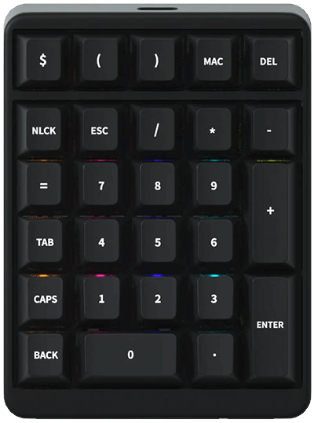

# IDOBAO Montex Pad

## Firmware

*(All VIA enabled.)*

| Variant       | Identifying Features                                | `HEX` file | Source Location |
|---------------|-----------------------------------------------------|------------|:---------------:|
| Montex *(V1)* | 4x Underglow RGB, white only per-key LED's          | [<i class="fas fa-microchip"></i> `idobao_montex_v1_via.hex`]({{ site.github_raw_path }}/firmware/idobao_montex_v1_via.hex) | [<i class="fab fa-github"></i> QMK]({{ site.github_qmk_path }}/montex/v1) |
| Montex RGB    | 4x Underglow RGB, 27x per-key RGB                   | [<i class="fas fa-microchip"></i> `idobao_montex_v2_via.hex`]({{ site.github_raw_path }}/firmware//idobao_montex_v2_via.hex) | *(unpublished)* | 

<!-- 
| Montex V2 RGB | 4x Underglow RGB, 27x per-key RGB, "V2" designator  | *(unpublished)* | *(unpublished)* |
-->

---



