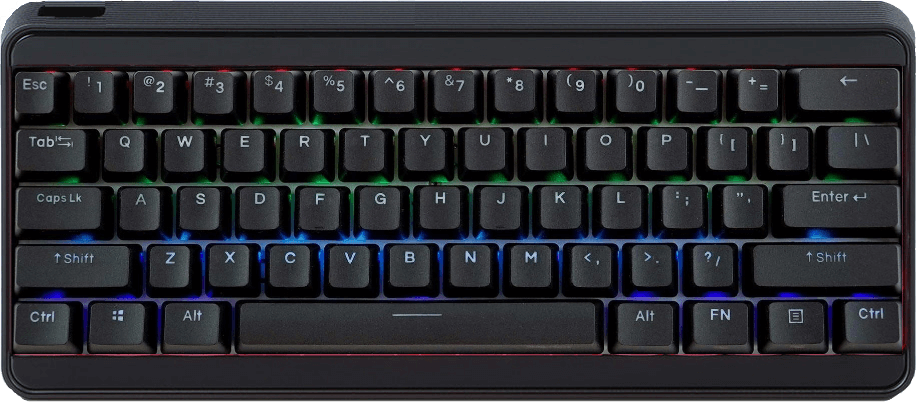
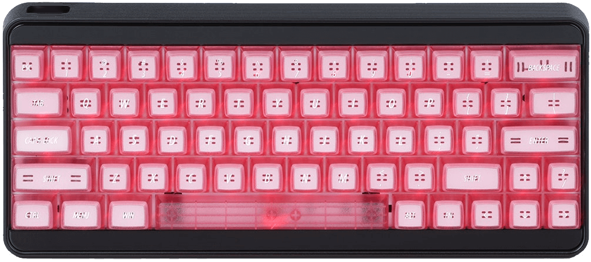

# IDOBAO Denwir 60 *(ID61 & ID63)*

## Firmware

*(All VIA enabled.)*

{: .table .table-striped .border .align-middle }
| Variant | Identifying Features  | Firmware `HEX` file1 | QMK Config2 | Source Location |
|---|---|---|---|---|
| ID61 | Traditional 60% / 61-key layout |  [<i class="fas fa-microchip"></i> `idobao_id611_idv.0.18.4.hex`]({{ site.github_release_path }}/idobao_id61_idv.0.18.4.hex) | [<i class="fas fa-cog"></i> `idobao/id61`](https://config.qmk.fm/#/idobao/id61/LAYOUT_60_ansi) | [<i class="fab fa-github"></i> QMK]({{ site.github_qmk_path }}/id61) |
| ID63 | Arrow keys & smaller right shift  | [<i class="fas fa-microchip"></i> `idobao_id63_idv.0.18.4.hex`]({{ site.github_release_path }}/idobao_id63_idv.0.18.4.hex) | [<i class="fas fa-cog"></i> `idobao/id63`](https://config.qmk.fm/#/idobao/id63/LAYOUT_60_ansi_arrow) | [<i class="fab fa-github"></i> QMK]({{ site.github_qmk_path }}/id63) |

<small class="text-muted">1 = Factory / As sold *(VIA enabled)* 
2 = <i class="fas fa-exclamation-triangle"></i> No VIA support 

---


