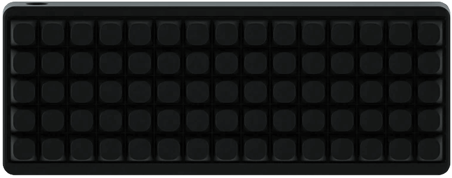

# IDOBAO ID75 *(Ortho)* 

## Variants:

| Variant          | Identifying Features | `HEX` file | Source Location |
|------------------|----------------------|------------|:---------------:|
| *(All versions)* | "Idobo" *(Drop)* ID75 V2 ID75 V3 *(Drop)* ID75 Crystal | [<i class="fas fa-microchip"></i> `idobao_id75_v1_via.hex`]({{ site.github_raw_path }}/firmware/idobao_id75_v1_via.hex) | [QMK]({{ site.github_qmk_path }}/id75/v1) |

---


