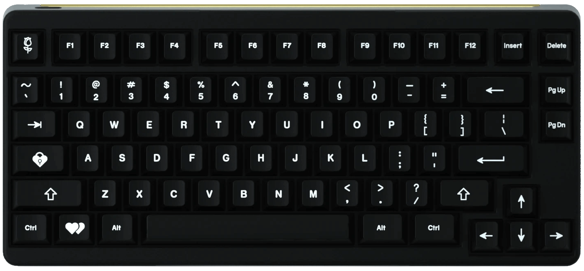

# IDOBAO ID80

## Variants:

| Variant       | Identifying Features                                | `HEX` file | Source Location |
|---------------|-----------------------------------------------------|------------|:---------------:|
| ID80 | Original Series, Aluminum bottom plate | [<i class="fas fa-microchip"></i> `idobao_id80_ansi_via.hex`]({{ site.github_raw_path }}/firmware/idobao_id80_ansi_via.hex) | [<i class="fab fa-github"></i> QMK]({{ site.github_qmk_path }}/id80/v1) |
| ID80 V2 | "V2" designator, Acrylic bottom plate | " | " |
| ID80 IK Blue | Idobao Klein Blue Special Series | " | " |
| ID80 Crystal | Polycarbonate case, ANSI (US) key layout | " | " |
| ID80 Bestype | Premium gasket mount | " | " |
| ID80 V2 Charm | Charm Blue Limited Edition  | " | " |
| ID80 ISO Crystal | Polycarbonate case, ISO (UK/EU) key layout | [<i class="fas fa-microchip"></i> `idobao_id80_iso_via.hex`]({{ site.github_raw_path }}/firmware/idobao_id80_iso_via.hex) | " |

<small class="d-block text-muted text-center"><i>" = (ditto) same as above</i></small>

---


