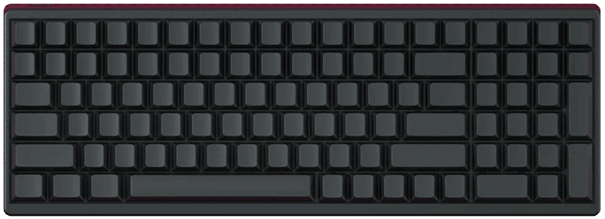

# IDOBAO ID96

## Variants:

| Variant | Identifying Features  | VIA `HEX` file 1 | QMK Config2 | Source Location |
|---------|-----------------------|-----------------------------|------------------------|:---------------:|
| ID96 | ID96 Solder PCB | [<i class="fas fa-microchip"></i> `idobao_id96_via.0.16.9.hex`]({{ site.github_raw_path }}/firmware/idobao_id96_via.0.16.9.hex) | [<i class="fas fa-cog"></i> `idobao/id96`](https://config.qmk.fm/#/idobao/id96/LAYOUT) | [<i class="fab fa-github"></i> QMK]({{ site.github_qmk_path }}/id96) |

<small class="text-muted">1 = Factory / As sold 
2 = <i class="fas fa-exclamation-triangle"></i> No VIA support</small>

---


