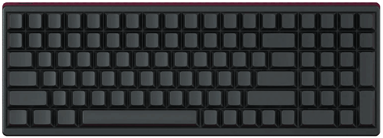
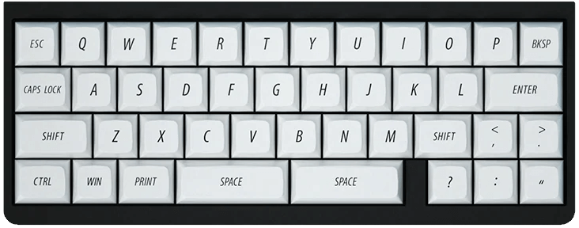
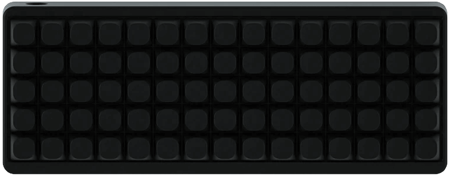
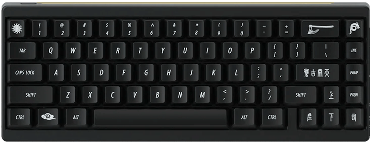
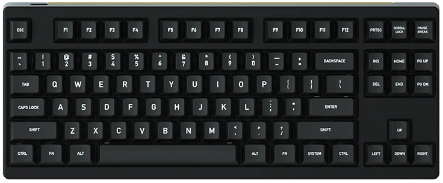

# Firmware

| Keyboard               |                                                       | Firmware                 |
|-----------------------:|:-----------------------------------------------------:|:-------------------------|
| Idobao Montex *(ID27)* |  | [Montex](id27.html)      |
| Idobao ID80            |  | [ID80](id80.html)        |
| Idobao ID96            |  | [ID96](id96.html)        |

<!--
| Idobao Abacus ID42     |  | [Abacus ID42](id42.html) |
| Idobao ID75 *(Ortho)*  |  | [ID75](id75.html)        |
| Idobao ID67            |  | [ID67](id67.html)        |
| Idobao ID87 (TKL)      |  | [ID87](id87.html)        |
-->
