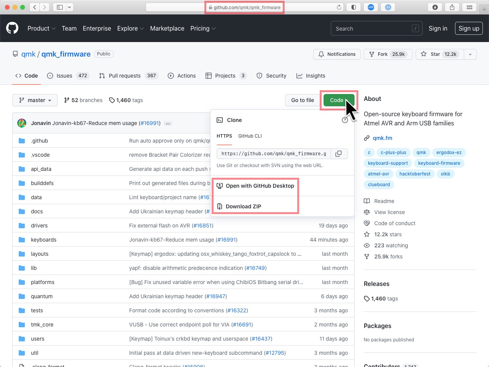

# Install firmware on your keyboard

1.  **Learn how**

    
  
    &nbsp;

{:start="2"}
2.  **Testing**

    Test your PCB to make sure all the switches / Kaihl sockets work.
    
    *( <i class="fas fa-info"></i> Note the [Fn] key does not trigger on the keyboard tester but you'll be able to test that on the next step.)*

    Use the online [Keyboard Tester](https://www.keyboardtester.com/tester.html)  

    Test every key on your computer keyboard from within your browser, no software needed.

3.  **Get your firmware file**

    -   For the default, VIA enabled, firmware

        - See our [<i class="fas fa-microchip"></i> Firmware](/firmware) pages for factory default firmware `.hex` files.

        - You can also use the firmware `.hex` files from [caniusevia.com/docs/download_firmware](https://www.caniusevia.com/docs/download_firmware).

        <i class="fas fa-exclamation"></i> Be sure to see our [<i class="fas fa-code"></i> Using VIA](/manuals/via/) page.

    *&lt; or &gt;*

    -   For custom firmare, configure your keymap in the online [QMK configurator](https://config.qmk.fm) tool.

        <i class="fas fa-exclamation"></i> Be sure to see our [<i class="fas fa-microchip"></i> QMK Configurator](/manuals/qmk/) page.

        1.  Select your keyboard from the top-most dropdown (e.g., `idobao/id80`). 

        2.  Customize the keys you want to chnage and then save the kaymap `keymap.json` to your local device.  
            This file is in case you want to upload it back to the Configurator site and edit keys later without having to rebuild your whole keymap.
            
            <i class="fas fa-exclamation"></i> Make sure you remember to set *(or keep)* a key mapped to `"Reset"` as this will be needed to ... reset.

        3.  Press the `[Compile]` button in the upper right, and once that finishes press the `[Download firmware]` button to download the your `.hex` file that will be used by the QMK toolbox to flash.

        <i class="fas fa-exclamation"></i> Note that VIA is <u class="text-danger">not</u> supported in these variants of the firmware.

4.  **Flash your keyboard**

    Make sure you've viewed the YouTube tutorial from **Step 1** *(then you should know what to do here <i class="fas fa-smile-beam text-success"></i>)*.

    The driver installer mentioned in the video is here: [github.com/qmk/qmk_driver_installer/releases](https://github.com/qmk/qmk_driver_installer/releases)

    The QMK Toolbox mentioned in the video is here: [github.com/qmk/qmk_toolbox/releases](https://github.com/qmk/qmk_toolbox/releases)

    <i class="fas fa-info"></i> Note the default keybinding for `"reset"` is [Fn] + [Esc].

---

#### Summary

---


