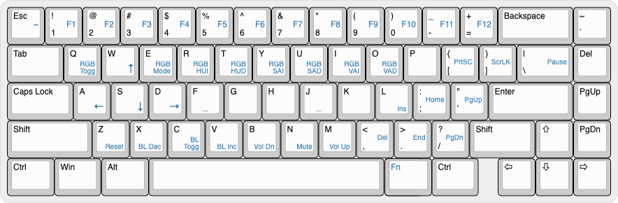

# ID67 Manual



1.  Introduction

    1.  ID67 Mechanical keyboard with type-C connection.

    2.  Compatible with Windows, Android, Mac, IOS.

    3.  Keyboard is drived by QMK firmware and editable.

    4.  Edit the keyboard with Json file on website: [http://kbfirmware.com](http://kbfirmware.com)

2.  Default layout

    

3.  Fn+key Functions

    |:---:|:---:|:---:|-----------------------------------|
    |     |     | 1-+ | F1-F12                            |
    |     |     |  W  | ↑                                 |
    |     |     |  A  | ←                                 |
    |     |     |  S  | ↓                                 |
    |     |     |  D  | →                                 |
    |     |     |  Q  | RGB Toggle                        |
    |     |     |  E  | RGB Mode                          |
    |     |     |  R  | RGB HUI (RGB hue increase)        |
    |     |     |  T  | RGB HUD (RGB hue decrease)        |
    |     |     |  Y  | RGB SAI (RGB saturation increase) |
    |     |     |  U  | RGB SAD (RGB saturation decrease) |
    |     |     |  I  | RGB VAI (RGB brightness increase) |
    | Fn  |  +  |  O  | RGB VAD (RGB brightness decrease) |
    |     |     |  {[ | PrtSC                             |
    |     |     |  }] | ScrLK                             |
    |     |     |  &#124;\ | Pause/Break                  |
    |     |     |  L  | Insert                            |
    |     |     |  :; | Home                              |
    |     |     |  "' | PgUp                              |
    |     |     |  <, | Delete                            |
    |     |     |  >. | End                               |
    |     |     |  ?/ | PgDn                              |
    |     |     |  B  | Vol-                              |
    |     |     |  N  | Mute                              |
    |     |     |  M  | Vol+                              |
    |     |     |  Z  | Reset or enter QMK reflash mode   |

4.  Reset:

    1.  Anything abnormal of the keyboard, you can reset it.

    2.  Press the metal button on the back of the PCB (or press "Fn+Z"), you'll reset the keyboard to default layout, or enter QMK flashing mode.
    
    3.  Unplug and re-plug the USB cable,the keyboard is workable again.

---


