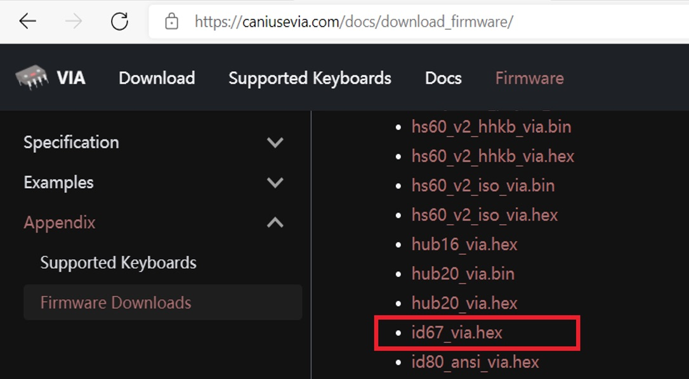
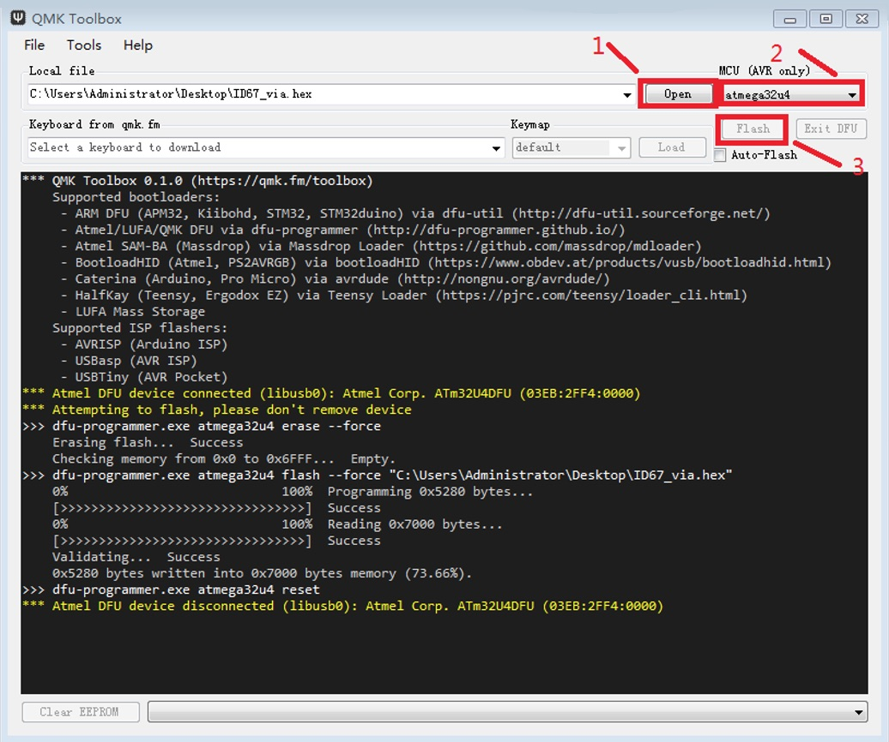
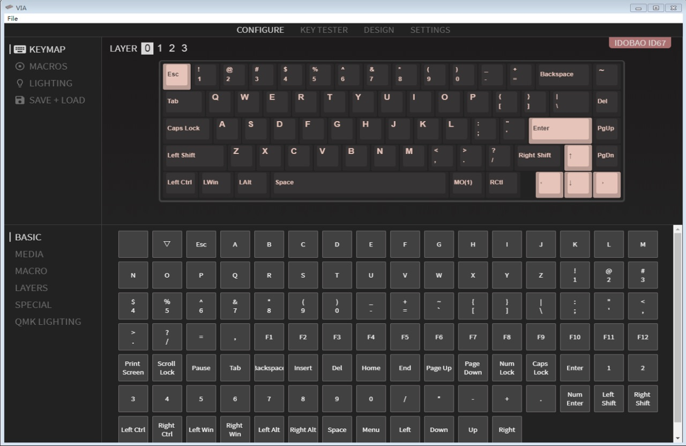

# QMK VIA Manual

If you have a keyboard drived by Atmega32u4 of QMK, you can edit the keyboard by VIA as following procedures

1.  Download and install software: : `via-?.?.?-win.exe` on website:

    (Windows choose `exe` file, Mac choose `dmg` file)

    [https://github.com/the-via/releases/releases](https://github.com/the-via/releases/releases)

2.  Download flashing tool: `qmk_toolbox.exe` on website:

    [https://github.com/qmk/qmk_toolbox/releases](https://github.com/qmk/qmk_toolbox/releases)

3.  Download VIA hex file (e.g., `ID67_VIA.hex`) on website

    [https://caniusevia.com/docs/download_firmware](https://caniusevia.com/docs/download_firmware)

    
 
4.  Open qmk_toolbox

    1.  On "Open" box, select: `ID67_via.hex`

    2.  On "MCU (AVR only)", select `atmega32u4`

    3.  Press the reset botton S1 on the PCBA (or press Fn+Z on the keyboard)

        It'll display "`***atmel DFU device connected................ .`"

    4. Press "Flash"

        It shows "`Success`", "`Atmel DFU device disconnected...... .`"
        
        Means the keyboard is ready to use

        

5.  Open software VIA, you are on windows of "KEYMAP", "BASIC"

    
 
    Now (if) you want to edit D (on KEYMAP-CONFIGURE-LAYER0) to 5

    1.  Select the layer you want to edit (e.g., LAYER 0)

    2.  Select the key you want to edit (e.g., D, it will twinkle)

    3.  Select 5 on window "BASIC", then the "D" will be changed to "5" on "KEYMAP"

    4.  Repeat step 1) to 3) to edit other keys

    5.  Thus the keyboard is edited successfully.

        You can use KEYTESTER to check it, if incorrect, repeat above step to complete it.

---


