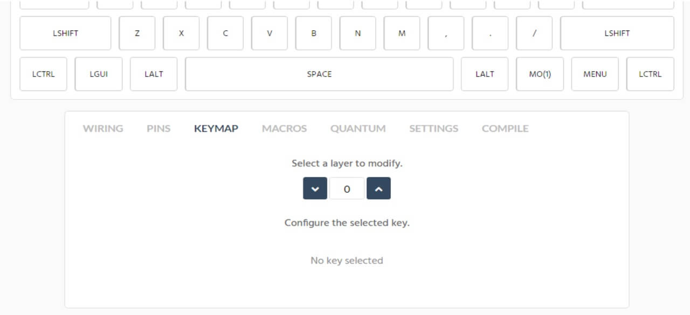
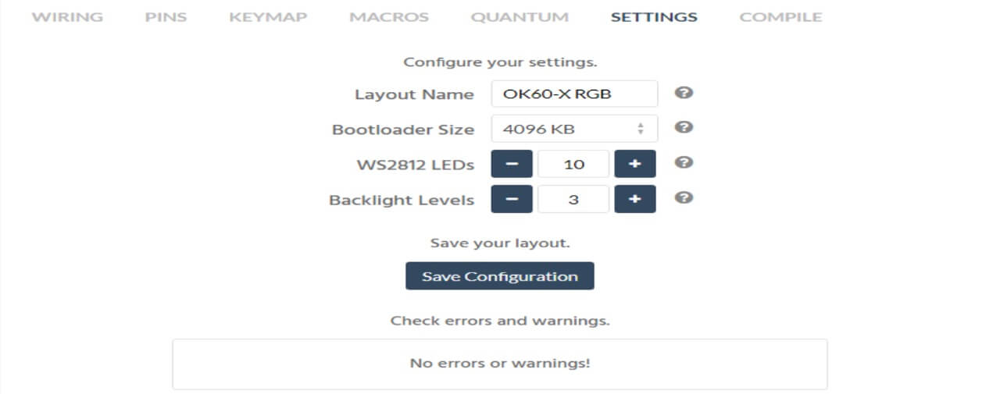
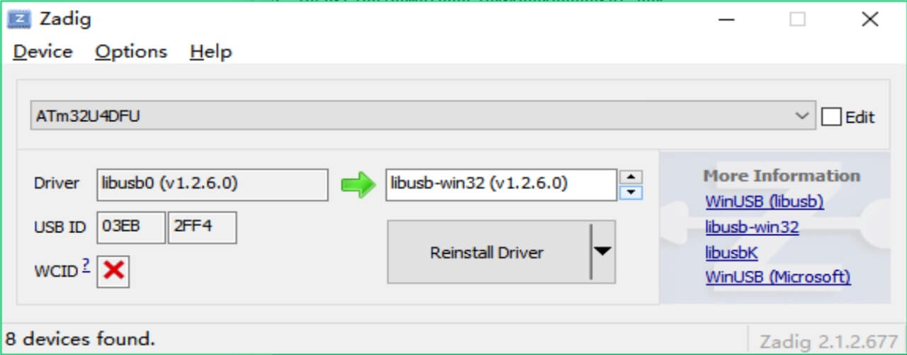

# ID80 QMK Hot Swap Programming Manuals



## Quick Start How To Program

1.  Download QMK Toolbox [https://github.com/qmk/qmk_toolbox/releases](https://github.com/qmk/qmk_toolbox/releases)

    Choose the toolbox according to your system, Mac system choose `pkg` or `app` file, Windows choose `toolbox.exe` file.

2.  Download [Zadig](https://zadig.akeo.ie/) or other driver updated software.

3.  Change layout on [www.mtkeyboard.vip](http://www.mtkeyboard.vip/)
    
    **Choose ID80 directly**

4.  Then press keymap

    You can select layer to change the keys, Layer 0 is the default layer you always use, layer 1 is the 2nd layer which is realized by [Fn].

    

5.  When you modify the keys ready, click Settings and it will show No errors or warnings! And then click Compile to download hex file.

    If something wrong,it will remind you of the fault.Just modify according to the reminder and then download hex file.

    

    

6.  Reset the keyboard

    -- Method 1, just shortcut reset 2 pin on the back

    -- Method 2, pull out USB from PC, press [Space] + [B[] together till inserting USB to PC.

7.  Open Zadig, click list all,c hoose **atmega32u4**

    Install the driver **libusb-win32** (v1.2.6.0).

    

8.  Open Toolbox, click open button to choose the hex file you just download, click flash. Make sure the chipset is **atmega32u4**.

    When it shows as below image,that means it succeeds.

    

9.  More details about keycode on kbfirmware, refer to [Keycodes](https://docs.qmk.fm/#/keycodes).

10. **How to record Mac**

    Choose a key as KC_M(n), go to Marcos page, then click Record Marco, press a list of actions on keyboard, then stop recording. Edit every action and download hex at last.

11. **How to Exchange between 6KRO and NKRO**

    Pull out USB from PC, press [Space] + [N] until inserting USB to PC.

12. **How to control RGB Underglow**

    Long press 5 together with 23456789 can control leds. We set 5 as LT(1.5). Tap it is 5, long press is [Fn]

13. If some keycode is messed up, such as [Lctrl] is shown [Caps], you can just press reset EEPROM and then flash

14. After programming, all led work, but keycode not work. This is mostly the issue with PC driver. Just open device manager and reset PCB, then choose **Atmel** and uninstall it. Then connect PCB to PC again.

---


