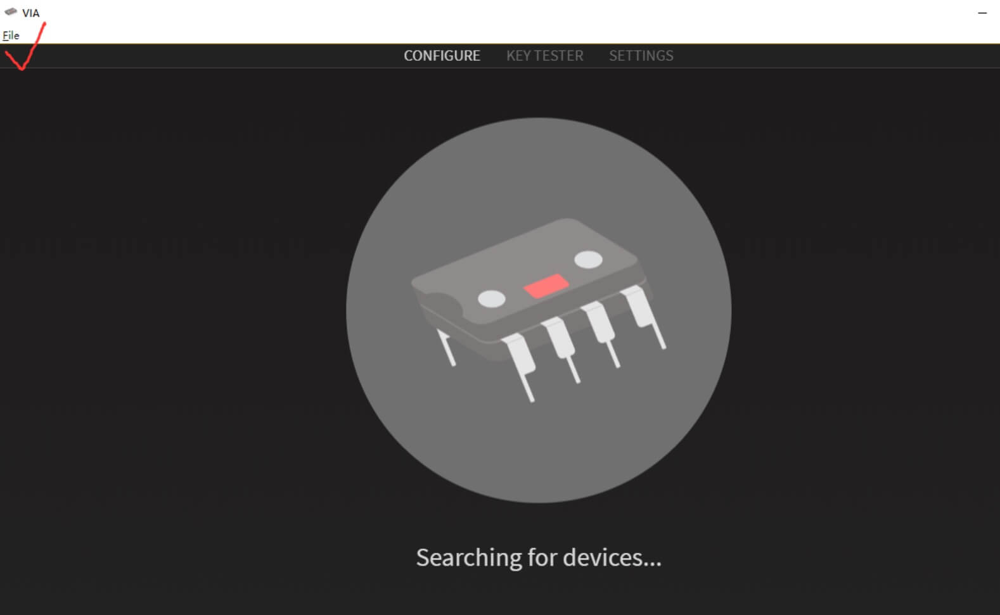

# ID80 Hot Swap PCB VIA Manuals



## Quick Start How To Program

1.  Download VIA software here (Windows and Mac choose different file,window choose `exe` file, Mac choose `dmg` file)

    [https://github.com/the-via/releases/releases/tag/v1.3.1](http://github.com/the-via/releases/releases/tag/v1.3.1)

2.  Use QMK Toolbox to program VIA hex file onto PCB at first. VIA hex file as below

    [*(Link removed)*]()

    QMK manuals in this PFD doc

    [*(Link removed)*]()

3.  Double Click VIA.EXE to open it

    

4.  Then it will come out Keymap page. You can just choose Layer and keycode on VIA directly. No need to reserve, it will modify onto PCB directly. <s>For ISO layout, there is no special file yet. Just reverse [Enter] [\|] keycode is ok.</s>

5.  More details about keycode,refer to [Keycodes](https://docs.qmk.fm/#/keycodes).

6.  If PCB is not working before programming,please confirm the cable you use is Type A to C. It does't support C to C cable.

7.  Before plugging switches,please test the PCB by the switch puller present. Just shortcut 2 end of socket is ok. And then begin to plug switches.

8.  **To install this kit**

    Install the stabilizers at first.

    Then please plug 5-6 switches into plate corners and middle part totally

    Then insert switches pin to PCB socket totally. After plate PCB fixed,plug other switches in is ok. At last screw PCB to the case. When plugging, you can put PCB onto desk which can avoid socket damage when plugging.

    If there is any big resistance when plugging switches, especially when you use Kailh switches, don't put it in forcely. Make sure the switch pin is not bent and the switches is around 90 degree.

9.  After plugging switches, if 1 or 2 key not working, check the switch pin whether it's bent at first. Then check whether the back socket is plugged loose.

    Even hotswap PCB don't need to solder as normal, however the socket is easily to be plugged loose or off after some times placing, so if you can prepare a cheap solder iron in hand, 1 hotswap PCB can use for many years. We sold many brand hotswap PCB now,these are experience from many customers.

---


