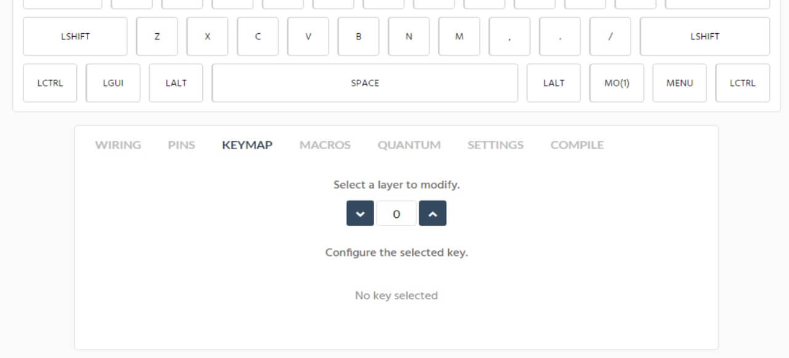
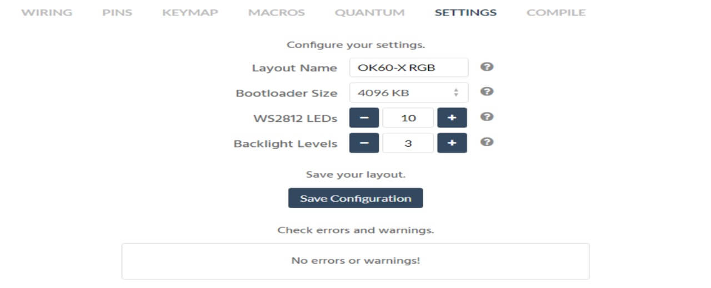
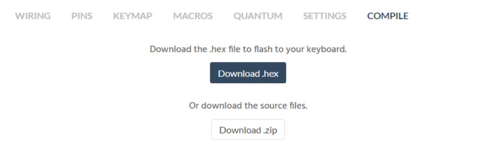
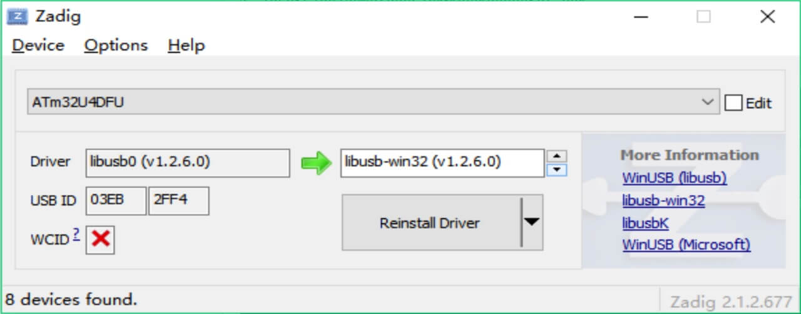
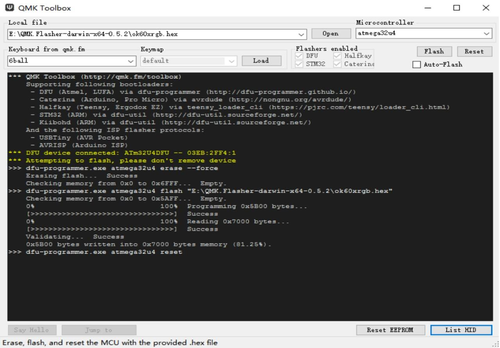

# ID87 Hotswap QMK Programming Manuals



## Quick Start How To Program

1.  Download QMK Toolbox [https://github.com/qmk/qmk_toolbox/releases](https://github.com/qmk/qmk_toolbox/releases)

    Choose the toolbox according to your system, Mac system choose `pkg` or `app` file, Windows choose `toolbox.exe` file.

2.  ~~Download [Zadig](https://zadig.akeo.ie/) or other driver updated software.~~

3.  Change layout on [www.mtkeyboard.vip](http://www.mtkeyboard.vip/). Click ID87 ANSI or ISO option directly is ok. For different layout, just change the keycode you need and ignore keycode which is not in your layout is ok.

4.  Then press keymap. You can select layer to change the keys, Layer 0 is the default layer you always use, layer 1 is the 2nd layer which is realized by [Fn].

    

5.  When you modify the keys ready,click Settings and it will show No errors or warnings! And then click Compile to download hex file.

    If something wrong,it will remind you of the fault.Just modify according to the reminder and then download hex file.

    

    

6.  Reset the keyboard

    First,Press reset button on the back of PCB is ok.
    Second, [Fn]+[Esc]
    Thrid, long press [Spc]+[B] while connecting PCB to computer (Need reset keycode on PCB in advance)

7.  ~~Open Zadig, click list all, choose **atmega32u4**~~

    ~~Install the driver **libusb-win32** (v1.2.6.0).~~

    

8.  Open Toolbox, click open button to choose the hex file Make sure the chipset is **atmega32u4**.

    When it shows as below image, that means it succeeds.

    
 
9.  More details about keycode, refer to [Keycodes](https://docs.qmk.fm/#/keycodes).

10. **How to record Macro**

    Choose a key as KC_M(n), go to Marcos page, then click Record Macro,press a list of actions on keyboard, then stop recording. Edit every action and download hex at last.

11. **How to Exchange between 6KRO and NKRO**
    
    Pull out USB from PC,press SPC+N until inserting USB to PC.

12. **How to control RGB Underglow**

    Long press Fn+QERTYUIOP

13. If some keycode is messed up, such as [Lctrl] is shown [Caps], you can just press reset eeprom and then press flash. Or get the cable off and press [Space]+[Backspace] while inserting PCB to PC.

14. After programming, if all keycode not work. This is mostly the issue with PC driver. Just open device manager and reset PCB, then choose **Atmel** and uninstall it. Then connect PCB to PC again.

15. If PCB is not working before programming, please confirm the cable you use is Type A to C. It does't support C to C cable.
 
16. Before plugging switches, please test the PCB by the switch puller present. Just shortcut 2 end of socket is ok. And then begin to plug switches.

17. **To install this kit**

    Install the stabilizers at first.

    Then please plug 5-6 switches into plate corners and middle part totally

    Then insert switches pin to PCB socket totally. After plate PCB fixed, plug other switches in is ok. At last screw PCB to the case. When plugging, you can put PCB onto desk which can avoid socket damage when plugging.

    If there is any big resistance when plugging switches, especially when you use kailh switches, don't put it in forcely. Make sure the switch pin is not bent and the switches is around 90 degree.

18. After plugging switches, if 1 or 2 key not working, check the switch pin whether it's bent at first. Then check whether the back socket is plugged loose.

    Even hotswap PCB don't need to solder as normal, however the socket is easily to be plugged loose or off after some times placing, so if you can prepare a cheap solder iron in hand, 1 hotswap PCB can use for many years. We sold many brand hotswap PCB now, these are experience from many customers.

---


