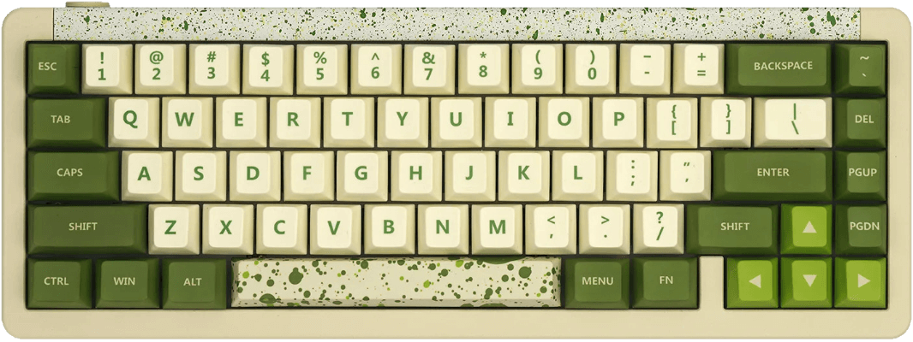

# VIA & Vial Support

There are currently two open-source applications that support QMK's VIA implementation. 

*Both work, so it's a personal choice, and both run on <i class="fab fa-windows"></i> Windows, <i class="fab fa-apple"></i> macOS or <i class="fab fa-linux"></i> Linux.*

Be sure to check back with their sites to make sure you have the latest builds.

  

    

      
      

        <h5 class="card-title text-shadow">VIA</h5>
        
The older app.

        <a href="https://usevia.app/" class="btn shadow" style="background-color:#AD7070;color:white"><svg class="fa"><use xlink:href="#via-logo"/></svg> usevia.app</a>
        <a href="https://www.caniusevia.com/" class="btn shadow" style="background-color:#AD7070;color:white"><svg class="fa"><use xlink:href="#via-logo"/></svg> caniusevia.com</a>
        

        
If you're looking for the original PC/Mac apps, you can get them at <a href="https://github.com/the-via/releases/releases">https://github.com/the-via/releases</a>

      

    

  

  

    

      
      

        <h5 class="card-title text-shadow">Vial</h5>
        
The newer app.

        <a href="https://vial.rocks/" class="btn shadow" style="background-color:#023E8A;color:white"><svg class="fa"><use xlink:href="#vial-logo"/></svg> vial.rocks</a>
        <a href="https://get.vial.today/" class="btn shadow" style="background-color:#023E8A;color:white"><svg class="fa"><use xlink:href="#vial-logo"/></svg> get.vial.today</a>
      

    

  



{: .my-3}
&nbsp;

{: .table .table-striped .border .align-middle }
| Keyboard |     | VIA Support |
|---------:|:---:|:------------|
| Idobao Montex *(ID27)* |  | *(Native)* [<i class="fas fa-info-circle"></i>](id27.html) *(All)* |
| Idobao Abacus ID42 |  | [<i class="fas fa-rotate-90 fa-download"></i> Abacus ID42 VIA](id42.html) |
| Idobao ID75 *(Ortholinear)* |  | *(Native)*1 [<i class="fas fa-comment-dots" title="more..."></i> more&hellip;](id75.html) |
| Idobao ID67 |  | *(Native)* [<i class="fas fa-info-circle"></i>](id67.html) *(V1)* & [<i class="fas fa-rotate-90 fa-download"></i> ID67 VIA](id67.html) *(V2)*   <i>or</i>   [<i class="fas fa-rotate-90 fa-download"></i> ID67 Plus VIA](id67plus.html) |
| Idobao ID80 |  | *(Native)* [<i class="fas fa-info-circle"></i>](id80.html) *(V1 & V2)*<!--  & [<i class="fas fa-rotate-90 fa-download"></i> ID80 VIA](id80.html) *(V3)* --> |
| Idobao ID87 *(TKL)* |  | *(Native)*1 [<i class="fas fa-comment-dots" title="more..."></i> more&hellip;](id87.html) |
| Idobao ID96 |  | *(Native)* [<i class="fas fa-info-circle"></i>](id96.html) |

-----

<small class="text-muted"><i class="fas fa-info-circle text-info"></i> The VIA application already supports keyboards marked as *"Native"* 
1 = there is more information on this.
</small>
