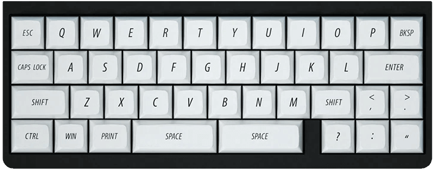

# VIA Support

There are currently two open-source applications that support QMK's VIA implementation. 

*Both work, so it's a personal choice, and both run on <i class="fab fa-windows"></i> Windows, <i class="fab fa-apple"></i> macOS or <i class="fab fa-linux"></i> Linux.*

Be sure to check back with their sites to make sure you have the latest builds.

  

    

      
      

        <h5 class="card-title text-shadow">VIA</h5>
        
The original app.

        <a href="https://www.caniusevia.com/" class="btn btn-success"><svg class="fa"><use xlink:href="#via-logo"/></svg> caniusevia.com</a>
      

    

  

  

    

      
      

        <h5 class="card-title text-shadow">Vial</h5>
        
The newer app.

        <a href="https://get.vial.today/" class="btn btn-primary"><svg class="fa"><use xlink:href="#vial-logo"/></svg> get.vial.today</a>
      

    

  

&nbsp;

{: .table .table-striped .border .align-middle }
| Keyboard |     | VIA Support |
|---------:|:---:|:------------|
| Idobao Montex *(ID27)* |  | *(Native)* [<i class="fas fa-info-circle"></i>](id27.html) *(V1)* [<i class="fas fa-code"></i> Montex VIA](id27.html) *(V2)* |
| Idobao Abacus ID42 |  | [<i class="fas fa-code"></i> Abacus ID42 VIA](id42.html) |
| Idobao ID75 *(Ortholinear)* |  | *(Native)*1 [<i class="fas fa-comment-dots" title="more..."></i>](id75.html) |
| Idobao ID67 |  | *(Native)* [<i class="fas fa-info-circle"></i>](id67.html) *(V1)* [<i class="fas fa-code"></i> ID67 VIA](id67.html) *(V2)* |
| Idobao ID80 |  | *(Native)* [<i class="fas fa-info-circle"></i>](id80.html) *(V1 & V2)* [<i class="fas fa-code"></i> ID80 VIA](id80.html) *(V3)* |
| Idobao ID87 *(TKL)* |  | *(Native)*1 [<i class="fas fa-comment-dots" title="more..."></i>](id87.html) |
| Idobao ID96 |  | *(Native)* [<i class="fas fa-info-circle"></i>](id96.html) |

-----

<small class="text-muted"><i class="fas fa-info-circle text-info"></i> The VIA application already supports keyboards marked as *"Native"* 
1 = there is more information on this.
</small>
