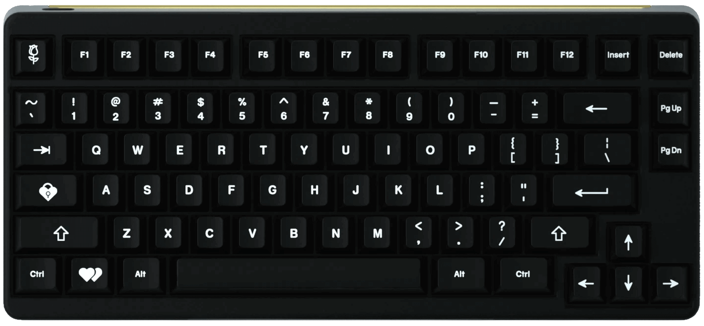
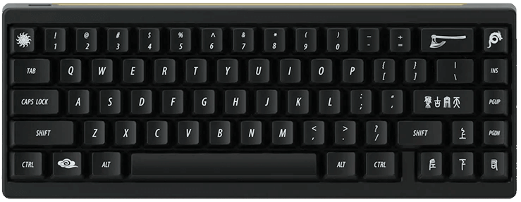

# VIA Support

| Keyboard               |                                                       | VIA Support                                                               |
|-----------------------:|:-----------------------------------------------------:|:--------------------------------------------------------------------------|
| Idobao Montex *(ID27)* |  | *(Native support in VIA)* [<i class="fas fa-info-circle"></i>](id27.html) |
| Idobao ID80            |  | *(Native support in VIA)* [<i class="fas fa-info-circle"></i>](id80.html) |
| Idobao ID96            |  | *(Native support in VIA)* [<i class="fas fa-info-circle"></i>](id96.html) |

-----

<small><i class="fas fa-info-circle text-info"></i> Keyboards marked as *"Native support in VIA"* don't need side-loaing, The VIA application already supports it.</small>

Be sure to install the latest version of VIA.  Visit [caniusevia.com](https://www.caniusevia.com/) for the latest builds.

<!--
| Idobao Abacus ID42     |  | [Abacus ID42](id42.html) |
| Idobao ID75 *(Ortho)*  |  | [ID75](id75.html)        |
| Idobao ID67            |  | [ID67](id67.html)        |
| Idobao ID87 (TKL)      |  | [ID87](id87.html)        |
-->
